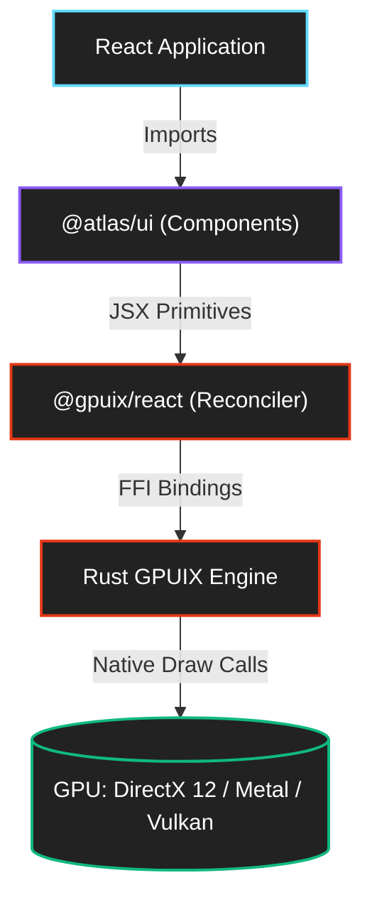

<div align="center">
  
  <h1>@atlas/ui</h1>
  <p><b>A massive, high-performance, GPU-accelerated React component library for desktop applications.</b></p>
  
  [](https://github.com/remorses/gpuix)
  [](https://reactjs.org/)
  [](https://www.typescriptlang.org/)
</div>

---

## Overview

`@atlas/ui` is an enterprise-grade, highly modular component library engineered specifically for the **GPUIX** framework. By completely bypassing the traditional browser DOM, HTML, and CSS, Atlas UI unlocks a new tier of desktop application performance. Every component in this library renders directly to the GPU using native graphics APIs—**DirectX 12 on Windows, Metal on macOS, and Vulkan on Linux**.

### Built for the Post-DOM Era
Traditional Electron or Tauri apps suffer from Chromium/WebKit bloat and DOM layout thrashing. Atlas UI solves this by leveraging a lightweight React 19 reconciler that translates your JSX directly into a Rust-powered retained scene graph. The result? **Silky smooth 120fps animations, sub-millisecond layout calculations, and a memory footprint a fraction of the size of a webview.**

### Massive Scale & Domain-Specific Modularity
With over **150+ native components**, Atlas UI goes far beyond basic buttons and inputs. It provides specialized, production-ready modules for:
*   **WAI-ARIA Compliant Foundations**: Fully custom headless engines for roving tabindex, focus trapping, and keyboard navigation in a DOM-less world.
*   **Agentic AI Interfaces**: Pre-built chat threads, thought-process tracers, and token meters for LLM copilots.
*   **Native Desktop Paradigms**: Command palettes, split panes, floating context menus, and native window drag areas.
*   **Hardware-Accelerated DataViz**: Real-time rendering of candlestick charts, sparklines, and heatmaps via the GPUIX `<canvas>` primitive.

Whether you are building a high-frequency trading dashboard, a native email client, or the next generation of AI workspaces, `@atlas/ui` provides the foundational blocks to build it fast, without compromising on bare-metal performance.

## Why Atlas UI?

* ⚡ **Zero DOM Overhead**: No HTML nodes, no CSS cascades, no `ResizeObserver` performance hits.
* 🎨 **Headless by Design**: Inspired by Radix and shadcn/ui, but adapted for raw scene-graph math and floating positioning without DOM elements.
* 🧠 **AI-Native Components**: Ships with a massive suite of pre-built UI for LLMs, agent trajectories, prompt engineering, and thought-traces.
* 📈 **Canvas-Driven DataViz**: Sparklines, Candlestick charts, and Heatmaps rendering via native 2D contexts.

## Installation

The library is designed to be consumed within a Bun workspace.

```bash
bun add @atlas/ui
```

Ensure your app is configured for GPUIX with the proper JSX import sources in `tsconfig.json`:

```json
{
  "compilerOptions": {
    "jsx": "react-jsx",
    "jsxImportSource": "@gpuix/react"
  }
}
```

## Quick Start

```tsx
import { Window } from '@gpuix/react'
import { ThemeProvider } from '@atlas/ui/core'
import { Button, Toast, Toaster, toastSuccess } from '@atlas/ui'

export function App() {
  return (
    <ThemeProvider>
      <Window title="My Atlas App">
        <Button onClick={() => toastSuccess("Action completed!")}>
          Click Me
        </Button>
        <Toaster />
      </Window>
    </ThemeProvider>
  )
}
```

## Component Ecosystem

The library is broken down into modular domains to keep your bundle lean.

### 🧱 Atoms & Layout (`/atoms`, `/layout`)
Fundamental building blocks and flex-based positioning grids.
* `Badge`, `Avatar`, `Button`, `Kbd`, `Icon`
* `Tabs`, `ResizablePanel`, `ScrollArea`, `VirtualList`, `Drawer`

### 🎛️ Inputs & Forms (`/inputs`)
Accessible, keyboard-navigable input primitives.
* `Combobox`, `DatePicker`, `FileDropzone`, `Slider`, `TagInput`, `ColorPicker`

### 🧩 Overlays & Display (`/overlays`, `/display`)
Floating panels with GPU-accelerated collision detection and WAI-ARIA inspired focus trapping.
* `ContextMenu`, `Dialog`, `Popover`, `HoverCard`, `Menubar`, `DataGrid`

### 🤖 AI Workspaces (`/ai`)
A complete toolkit for building Copilots and LLM monitoring tools.
* `AgentTrajectory`, `ChatThread`, `ThoughtCodeSplit`, `ToolCallCard`, `PromptDiff`

### 📊 Financial & DataViz (`/dataviz`, `/finance`)
High-performance charting and tracking components.
* `ActivitySparkline`, `CandlestickChart`, `Heatmap`, `AllocationDonut`, `AudioWaveform`

### 🖥️ Desktop Integrations (`/desktop`)
Native OS-level paradigms.
* `CommandMenu`, `WindowDragArea`, `ShortcutSettingsList`, `EmojiPicker`

## Architecture Notes



Because GPUIX lacks a DOM, Atlas UI implements its own headless engines for:
* **Roving Tabindex**: Fully custom `useRovingFocus` logic for arrow-key navigation.
* **Virtual Anchors**: Pointer-based positioning for `ContextMenu` without `getBoundingClientRect`.
* **Queue-based Toasts**: A module-level singleton bus for notifications (`toast()`).
* **Motion States**: Direct bindings to `@gpuix/react`'s `motion.div` for 60fps structural animations.

---
*Built for the future of desktop applications.*
