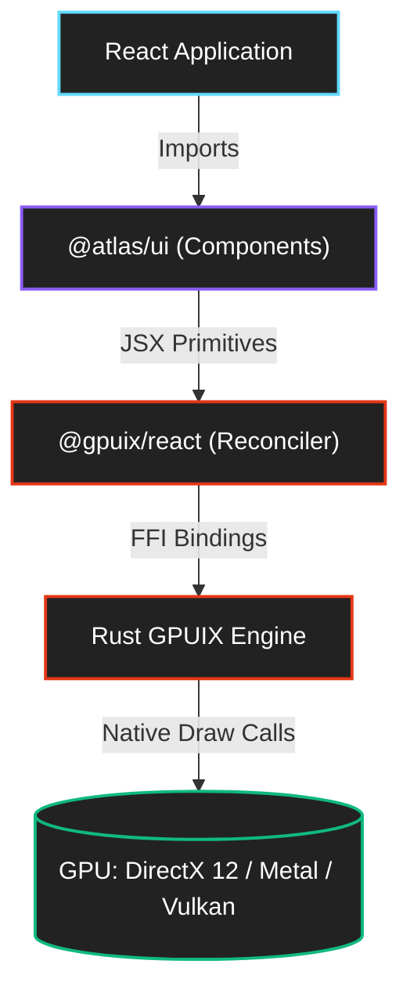

<div align="center">
  
  <h1>Atlas UI</h1>
  <p><b>A massive, high-performance, GPU-accelerated React component library for desktop applications.</b></p>
  
  [](https://github.com/remorses/gpuix)
  [](https://reactjs.org/)
  [](https://www.typescriptlang.org/)
</div>

---

## Overview

`@atlas/ui` is an enterprise-grade, highly modular component library engineered specifically for the **GPUIX** framework. By completely bypassing the traditional browser DOM, HTML, and CSS, Atlas UI unlocks a new tier of desktop application performance. Every component in this library renders directly to the GPU using native graphics APIs—**DirectX 12 on Windows, Metal on macOS, and Vulkan on Linux**.

### Built for the Post-DOM Era
Traditional Electron or Tauri apps suffer from Chromium/WebKit bloat and DOM layout thrashing. Atlas UI solves this by leveraging a lightweight React 19 reconciler that translates your JSX directly into a Rust-powered retained scene graph. The result? **Silky smooth 120fps animations, sub-millisecond layout calculations, and a memory footprint a fraction of the size of a webview.**

### Massive Scale & Domain-Specific Modularity
With over **150+ native components**, Atlas UI goes far beyond basic buttons and inputs. It provides specialized, production-ready modules for:
*   **WAI-ARIA Compliant Foundations**: Fully custom headless engines for roving tabindex, focus trapping, and keyboard navigation in a DOM-less world.
*   **Agentic AI Interfaces**: Pre-built chat threads, thought-process tracers, and token meters for LLM copilots.
*   **Native Desktop Paradigms**: Command palettes, split panes, floating context menus, and native window drag areas.
*   **Hardware-Accelerated DataViz**: Real-time rendering of candlestick charts, sparklines, and heatmaps via the GPUIX `<canvas>` primitive.

Whether you are building a high-frequency trading dashboard, a native email client, or the next generation of AI workspaces, `@atlas/ui` provides the foundational blocks to build it fast, without compromising on bare-metal performance.

## Why Atlas UI?

* ⚡ **Zero DOM Overhead**: No HTML nodes, no CSS cascades, no `ResizeObserver` performance hits.
* 🎨 **Headless by Design**: Inspired by Radix and shadcn/ui, but adapted for raw scene-graph math and floating positioning without DOM elements.
* 🧠 **AI-Native Components**: Ships with a massive suite of pre-built UI for LLMs, agent trajectories, prompt engineering, and thought-traces.
* 📈 **Canvas-Driven DataViz**: Sparklines, Candlestick charts, and Heatmaps rendering via native 2D contexts.

## Installation

The library is designed to be consumed within a Bun workspace.

```bash
bun add @atlas/ui
```

Ensure your app is configured for GPUIX with the proper JSX import sources in `tsconfig.json`:

```json
{
  "compilerOptions": {
    "jsx": "react-jsx",
    "jsxImportSource": "@gpuix/react"
  }
}
```

## Quick Start

```tsx
import { Window } from '@gpuix/react'
import { ThemeProvider } from '@atlas/ui/core'
import { Button, Toast, Toaster, toastSuccess } from '@atlas/ui'

export function App() {
  return (
    <ThemeProvider>
      <Window title="My Atlas App">
        <Button onClick={() => toastSuccess("Action completed!")}>
          Click Me
        </Button>
        <Toaster />
      </Window>
    </ThemeProvider>
  )
}
```

## Component Ecosystem

The library is broken down into modular domains to keep your bundle lean.

### 🧱 Atoms & Layout (`/atoms`, `/layout`)
Fundamental building blocks and flex-based positioning grids.
* `Badge`, `Avatar`, `Button`, `Kbd`, `Icon`
* `Tabs`, `ResizablePanel`, `ScrollArea`, `VirtualList`, `Drawer`

### 🎛️ Inputs & Forms (`/inputs`)
Accessible, keyboard-navigable input primitives.
* `Combobox`, `DatePicker`, `FileDropzone`, `Slider`, `TagInput`, `ColorPicker`

### 🧩 Overlays & Display (`/overlays`, `/display`)
Floating panels with GPU-accelerated collision detection and WAI-ARIA inspired focus trapping.
* `ContextMenu`, `Dialog`, `Popover`, `HoverCard`, `Menubar`, `DataGrid`

### 🤖 AI Workspaces (`/ai`)
A complete toolkit for building Copilots and LLM monitoring tools.
* `AgentTrajectory`, `ChatThread`, `ThoughtCodeSplit`, `ToolCallCard`, `PromptDiff`

### 📊 Financial & DataViz (`/dataviz`, `/finance`)
High-performance charting and tracking components.
* `ActivitySparkline`, `CandlestickChart`, `Heatmap`, `AllocationDonut`, `AudioWaveform`

### 🖥️ Desktop Integrations (`/desktop`)
Native OS-level paradigms.
* `CommandMenu`, `WindowDragArea`, `ShortcutSettingsList`, `EmojiPicker`

## Architecture Notes



Because GPUIX lacks a DOM, Atlas UI implements its own headless engines for:
* **Roving Tabindex**: Fully custom `useRovingFocus` logic for arrow-key navigation.
* **Virtual Anchors**: Pointer-based positioning for `ContextMenu` without `getBoundingClientRect`.
* **Queue-based Toasts**: A module-level singleton bus for notifications (`toast()`).
* **Motion States**: Direct bindings to `@gpuix/react`'s `motion.div` for 60fps structural animations.

---
*Built for the future of desktop applications.*


## Complete Component Index

Below is the exhaustive list of all 200+ native GPUIX components, hooks, and layouts included in `@atlas/ui`.

<details>
<summary><b>🤖 AI Workspaces (58)</b></summary>
<p>
<code>AgentFlowGraph</code>, <code>AgentMonitor</code>, <code>AgentRunCard</code>, <code>AgentRunSteps</code>, <code>AgentTrajectory</code>, <code>AssistWorkspace</code>, <code>BranchExplorer</code>, <code>ChatBubble</code>, <code>ChatSearchBar</code>, <code>ChatThread</code>, <code>ConfigDiffReview</code>, <code>ContextBrowser</code>, <code>ContextRing</code>, <code>DocumentQAPanel</code>, <code>GeneratedCodeCard</code>, <code>HelpCopilot</code>, <code>InlineCitations</code>, <code>InlineCodeChip</code>, <code>InterruptibleComposer</code>, <code>LatencyLog</code>, <code>LiveAgentGrid</code>, <code>MentionInput</code>, <code>MessageScroller</code>, <code>MessageStatus</code>, <code>ModelJourney</code>, <code>ModelLab</code>, <code>ModelPerformanceTable</code>, <code>ModelPicker</code>, <code>PromptDiff</code>, <code>PromptEngineeringSuite</code>, <code>PromptHistoryList</code>, <code>PromptInput</code>, <code>PromptSettings</code>, <code>PromptTemplateEditor</code>, <code>RegenerateBar</code>, <code>ResponseComparer</code>, <code>ReviewPanel</code>, <code>RunCostCard</code>, <code>RunInspector</code>, <code>SamplerControls</code>, <code>SandboxStepLog</code>, <code>ScoringPanel</code>, <code>SelectAndAsk</code>, <code>SelectionToPrompt</code>, <code>SourceList</code>, <code>StreamingDiff</code>, <code>StreamingMarkdown</code>, <code>SystemPromptCard</code>, <code>TaskDoneBanner</code>, <code>ThinkingIndicator</code>, <code>ThoughtCodeSplit</code>, <code>TokenMeter</code>, <code>ToolCallCard</code>, <code>ToolPermissionPrompt</code>, <code>TranscriptSync</code>, <code>UsageBudgetCard</code>, <code>VersionedPromptLibrary</code>, <code>VoiceStudio</code>
</p>
</details>

<details>
<summary><b>📋 Display & Data (48)</b></summary>
<p>
<code>ActionChips</code>, <code>Alert</code>, <code>BackToTop</code>, <code>BeforeAfterSlider</code>, <code>BulkActionsBar</code>, <code>Calendar</code>, <code>ColumnVisibilityMenu</code>, <code>CommandMenu</code>, <code>ConfirmPopover</code>, <code>ContextRow</code>, <code>DataGrid</code>, <code>DataTable</code>, <code>DescriptionList</code>, <code>DetailPanel</code>, <code>Divider</code>, <code>EmptyState</code>, <code>FilterBar</code>, <code>GhostDragPreview</code>, <code>GroupedVirtualList</code>, <code>HintBar</code>, <code>HoverCard</code>, <code>JsonTree</code>, <code>KanbanBoard</code>, <code>Marker</code>, <code>PaginatedTable</code>, <code>Pagination</code>, <code>Popover</code>, <code>RelativeTime</code>, <code>ReorderableList</code>, <code>RetryView</code>, <code>ScrollSpy</code>, <code>SearchableList</code>, <code>SearchEmpty</code>, <code>SearchHighlights</code>, <code>SettingRow</code>, <code>SparklineStat</code>, <code>StatCard</code>, <code>StatusDot</code>, <code>StepIndicator</code>, <code>SummaryFooter</code>, <code>TableChrome</code>, <code>ThemeCustomizer</code>, <code>Timeline</code>, <code>Tooltip</code>, <code>TreeTable</code>, <code>TrendBadge</code>, <code>UploadProgress</code>, <code>VirtualTree</code>
</p>
</details>

<details>
<summary><b>🧩 Composites & Modules (36)</b></summary>
<p>
<code>ActionToast</code>, <code>ActivityFeed</code>, <code>AdminTable</code>, <code>AgentRunConsole</code>, <code>AnimatedStat</code>, <code>AssetDetailPanel</code>, <code>AuditTrail</code>, <code>CalendarEventEditor</code>, <code>ChatWindow</code>, <code>CitationTooltip</code>, <code>CitedAnswer</code>, <code>DataExplorer</code>, <code>DebugInspector</code>, <code>DiffViewer</code>, <code>EditorTabStrip</code>, <code>FileBrowser</code>, <code>FilterableTable</code>, <code>InlineEditableField</code>, <code>KeyboardShortcutsOverlay</code>, <code>LogViewer</code>, <code>MultiSelectCombobox</code>, <code>NotificationCenter</code>, <code>OnboardingChecklist</code>, <code>PromptComposer</code>, <code>PromptStudio</code>, <code>QuickSwitcher</code>, <code>ReasoningTrace</code>, <code>SelectionList</code>, <code>StatusBar</code>, <code>ToastWithProgress</code>, <code>Toolbar</code>, <code>TransferList</code>, <code>UsageDashboard</code>, <code>UserMenu</code>, <code>VirtualizedSelect</code>, <code>WizardDialog</code>
</p>
</details>

<details>
<summary><b>🎛️ Inputs & Forms (23)</b></summary>
<p>
<code>Checkbox</code>, <code>ColorPicker</code>, <code>ComboboxField</code>, <code>DatePicker</code>, <code>DateRangePicker</code>, <code>Field</code>, <code>FileDropzone</code>, <code>NumberField</code>, <code>PasswordField</code>, <code>PinInput</code>, <code>ProgressBar</code>, <code>RadioGroup</code>, <code>SearchInput</code>, <code>SegmentedControl</code>, <code>SelectField</code>, <code>ShortcutRecorder</code>, <code>Slider</code>, <code>StarRating</code>, <code>Switch</code>, <code>TagInput</code>, <code>TextareaAutosize</code>, <code>TimePicker</code>, <code>TypeaheadInput</code>
</p>
</details>

<details>
<summary><b>🖥️ Desktop Integrations (23)</b></summary>
<p>
<code>AboutDialog</code>, <code>AutoSavePill</code>, <code>ConnectBar</code>, <code>CrashDialog</code>, <code>DownloadCard</code>, <code>EmojiPicker</code>, <code>FavoritesBar</code>, <code>FindBar</code>, <code>FontPicker</code>, <code>GroupedSidebarNav</code>, <code>LicensesDialog</code>, <code>PermissionGate</code>, <code>PreviewPane</code>, <code>PropertyGrid</code>, <code>RecentFilesList</code>, <code>ReleaseNotesDialog</code>, <code>ShortcutSettingsList</code>, <code>ThemeSwitcher</code>, <code>ToolboxRail</code>, <code>UnsavedChangesDialog</code>, <code>VersionFooter</code>, <code>WordCountBar</code>, <code>ZoomControls</code>
</p>
</details>

<details>
<summary><b>📐 Layout (19)</b></summary>
<p>
<code>Accordion</code>, <code>Breadcrumb</code>, <code>Card</code>, <code>Col</code>, <code>Drawer</code>, <code>FormCard</code>, <code>InfiniteScroll</code>, <code>ResizablePanel</code>, <code>Row</code>, <code>ScrollArea</code>, <code>Spacer</code>, <code>StickyHeader</code>, <code>SyncedScrollPane</code>, <code>Tabs</code>, <code>TitleBar</code>, <code>TreeView</code>, <code>VirtualizedGrid</code>, <code>VirtualList</code>, <code>WindowDragArea</code>
</p>
</details>

<details>
<summary><b>📊 DataViz (15)</b></summary>
<p>
<code>ActivitySparkline</code>, <code>AudioWaveform</code>, <code>BarChart</code>, <code>BulletChart</code>, <code>CalendarHeatmap</code>, <code>Chart</code>, <code>CircularProgress</code>, <code>Confetti</code>, <code>DonutChart</code>, <code>Gauge</code>, <code>Heatmap</code>, <code>LineChart</code>, <code>MultiSeriesLineChart</code>, <code>RadialGauge</code>, <code>StackedBarChart</code>
</p>
</details>

<details>
<summary><b>🪝 Hooks (25)</b></summary>
<p>
<code>useAsync</code>, <code>useControllableState</code>, <code>useCopyState</code>, <code>useCounter</code>, <code>useDebouncedCallback</code>, <code>useDebouncedValue</code>, <code>useDisclosure</code>, <code>useFocusTrap</code>, <code>useFocusVisible</code>, <code>useHotkeys</code>, <code>useHover</code>, <code>useIdle</code>, <code>useIsKeyDown</code>, <code>useIsMounted</code>, <code>useKeyPress</code>, <code>useLatest</code>, <code>useListState</code>, <code>useMultiSelect</code>, <code>usePagination</code>, <code>usePointerDrag</code>, <code>usePrevious</code>, <code>useRovingFocus</code>, <code>useScrollPosition</code>, <code>useTimer</code>, <code>useWindowQuery</code>
</p>
</details>

<details>
<summary><b>🧱 Atoms (9)</b></summary>
<p>
<code>Avatar</code>, <code>Badge</code>, <code>Button</code>, <code>CopyButton</code>, <code>Icon</code>, <code>IconButton</code>, <code>IconLabel</code>, <code>Kbd</code>, <code>SplitButton</code>
</p>
</details>

<details>
<summary><b>🪟 Overlays (9)</b></summary>
<p>
<code>AlertDialog</code>, <code>ContextMenu</code>, <code>Dialog</code>, <code>FocusScope</code>, <code>LayoutInspectorHUD</code>, <code>LoadingOverlay</code>, <code>Menubar</code>, <code>OnboardingTour</code>, <code>Toast</code>
</p>
</details>

<details>
<summary><b>✨ Effects (8)</b></summary>
<p>
<code>AnimatedBackground</code>, <code>AnimatedCounter</code>, <code>GradientText</code>, <code>Skeleton</code>, <code>SkeletonRow</code>, <code>Spinner</code>, <code>StreamingText</code>, <code>SyntaxCodeBlock</code>
</p>
</details>

<details>
<summary><b>📈 Finance (7)</b></summary>
<p>
<code>AllocationDonut</code>, <code>BalanceCard</code>, <code>BudgetBar</code>, <code>CandlestickChart</code>, <code>KpiGrid</code>, <code>PnlBadge</code>, <code>TransactionList</code>
</p>
</details>
